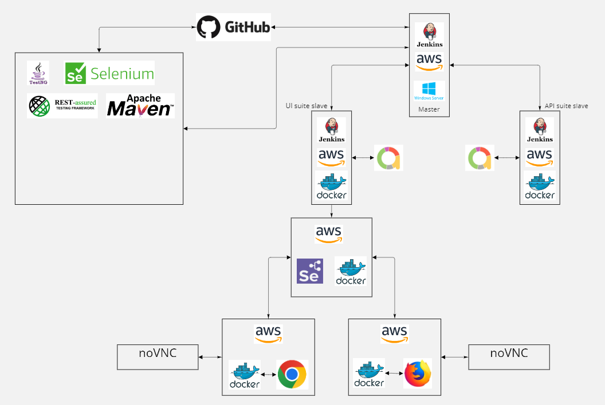

## About test project

This project is an example of a test environment for automation test runs and uses such tools like:
Jenkins, Docker, AWS, Java, TestNg, Allure, Maven e.t.c. .

### How it work`s

Each jenkins job is launched on separate jenkins node and each node is created on separate AWS unix instance with
docker container inside.

#### Jenkins

Jenkins has some jobs:

- :white_check_mark: ui,
- :white_check_mark: api,
- :black_square_button: mobile,
- :black_square_button: desktop,
- :black_square_button: regression 

Each job launch is triggered by git action(push), schedule or by manual launch.

Jenkins components:
- [Open Jenkins master](http://18.216.186.143:8080/);
- Jenkins slave for UI test suite;
- Jenkins slave for API test suite;
- Jenkins slave for regression test suite.

#### AWS

  - JenkinsMaster (windows)
  - Jenkins slave api tests (unix)
  - Jenkins slave UI tests (unix)
  - Selenium hub for nodes (unix)
  - Selenium node FF (unix)
  - Selenium node Chrome (unix)
  - 
#### Docker containers
  
  - [Open Selenium hub](http://18.117.177.129:4444/ui#);
  - [Open Selenium node FF](http://13.58.43.136:5555);
  - [Open Selenium node Chrome](http://3.141.33.104:5555);

#### Maven
  
#### TestNg

#### Allure

Allure generates reports after test run.
- [Open ui report](http://18.216.186.143:8080/job/Octopuz_ui/allure/);
- [Open api report](http://18.216.186.143:8080/job/Octopuz_api/allure/);
#### noVnc

noVNC online preview of test run on web browser
- [Connect to online preview FF browser](http://3.141.33.104:7900/) pass: secret;
- [Connect to online preview FF browser](http://13.58.43.136:7900/) pass: secret;

### Possible problems

-Free AWS uses dynamic ip, so after power of or reboot it will be impossible to connect for some stations.